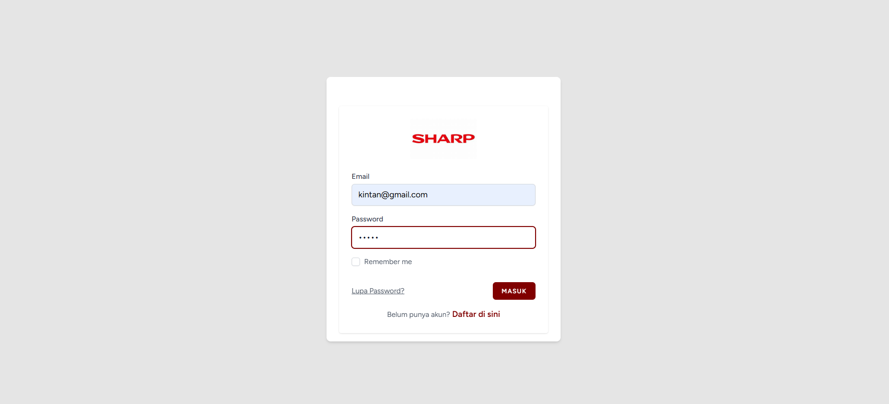
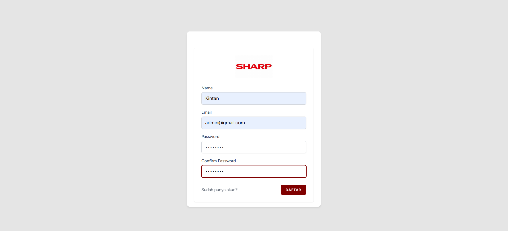
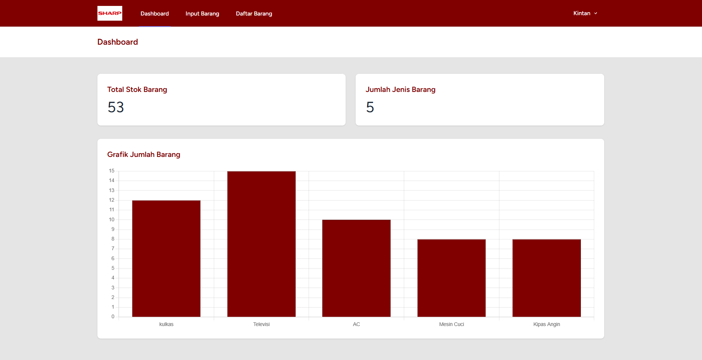
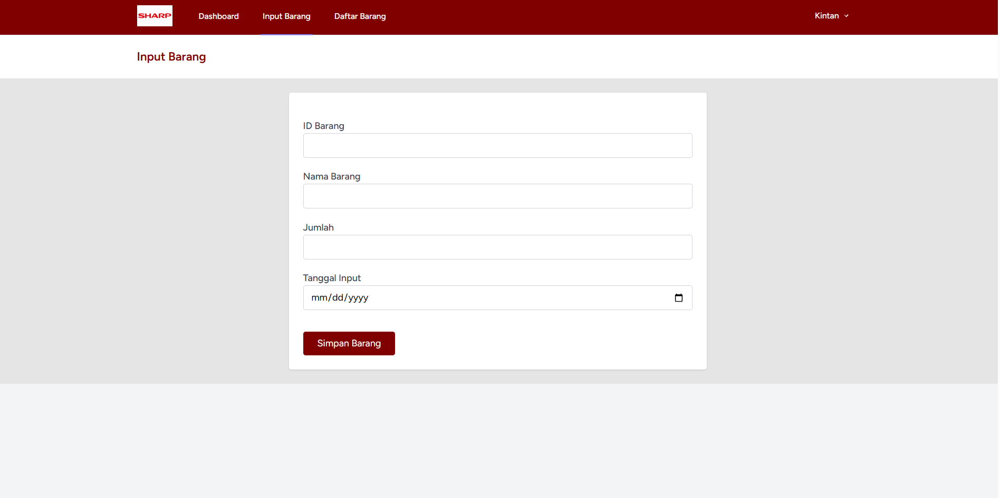
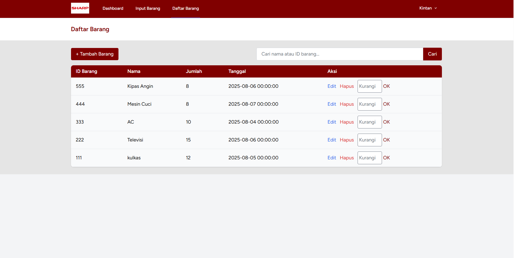
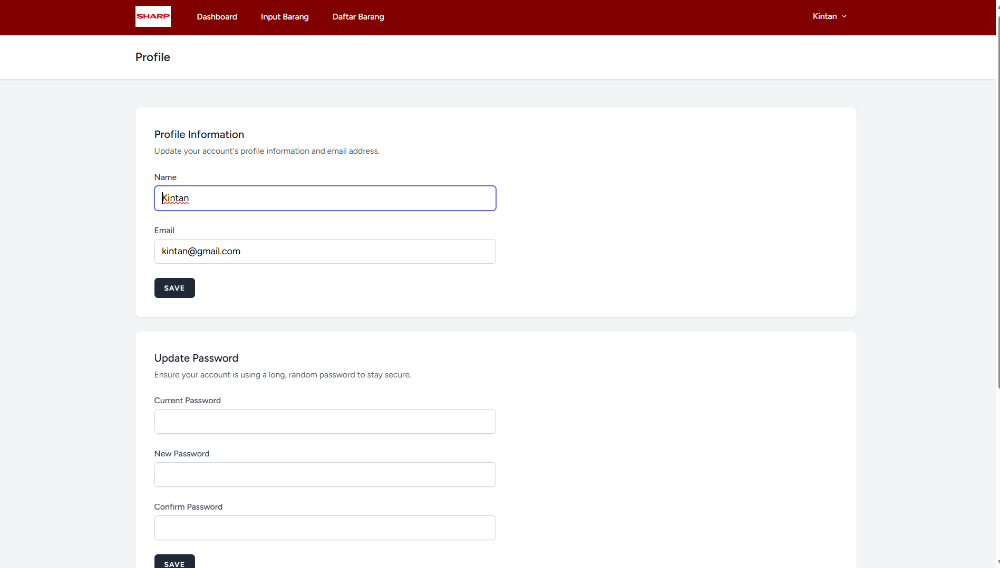

# **APLIKASI INVENTORY BARANG PT. SHARP SEMICONDUCTOR INDONESIA**

Oleh : Kintan Kinasih Mahaputri

## **Penjelasan Aplikasi**
Aplikasi ini adalah sistem informasi manajemen inventaris barang berbasis web yang dikembangkan menggunakan framework Laravel dan Tailwind CSS untuk frontend styling. Aplikasi ini dirancang untuk membantu perusahaan atau organisasi dalam mencatat, mengelola, dan memantau stok barang secara efisien dan real-time.

**Fitur Autentikasi**
Aplikasi ini menggunakan Laravel Breeze sebagai sistem autentikasi. Pengguna harus terdaftar dan login terlebih dahulu untuk bisa mengakses fitur manajemen barang. Hal ini menjaga keamanan data, memastikan hanya pengguna yang berwenang yang dapat memodifikasi inventaris.

**Dashboard**
Halaman dashboard menampilkan ringkasan data inventaris dalam bentuk angka dan grafik:

Total Stok Barang

Jumlah Jenis Barang

Grafik batang (bar chart) yang menunjukkan jumlah stok masing-masing jenis barang

Visualisasi ini membantu manajemen untuk mengambil keputusan berbasis data dengan lebih cepat dan tepat.

**Input Barang**
Fitur ini memungkinkan pengguna untuk menambahkan data barang ke dalam sistem. Formulir input mencakup:

ID Barang (unik)

Nama Barang

Jumlah Stok

Tanggal Input

Data yang masuk akan divalidasi untuk memastikan tidak ada duplikasi dan sesuai dengan format yang ditentukan.

**Daftar Barang**
Semua barang yang telah diinput akan ditampilkan dalam tabel dengan desain rapi dan profesional. Fitur tambahan pada daftar barang meliputi:

Pencarian (search) berdasarkan nama atau ID barang

Tombol aksi untuk edit, hapus, dan pengurangan stok

Desain yang responsif untuk desktop dan mobile

**Edit Barang**
Memungkinkan pengguna memperbarui informasi barang, seperti nama, jumlah stok, dan tanggal input. Form edit ditampilkan dengan nilai yang telah ada sebelumnya untuk memudahkan proses pengeditan.
**Hapus Barang**
Pengguna dapat menghapus data barang dari sistem. Sebelum penghapusan dilakukan, sistem akan meminta konfirmasi agar tidak terjadi penghapusan data secara tidak sengaja.
**Kurangi Stok**
Fitur ini memungkinkan pengguna untuk mengurangi jumlah stok suatu barang, misalnya jika ada barang keluar dari gudang. Jumlah yang dikurangi akan langsung tercermin di daftar barang.

**Profil** dalam aplikasi ini berfungsi untuk mengelola data pribadi pengguna yang sedang login.
Lihat Informasi Akun
Menampilkan nama dan email pengguna yang sedang login.

**Edit Data Pribadi**

Nama lengkap

Alamat email

**Ganti Password**

**Hapus Akun (opsional)**

